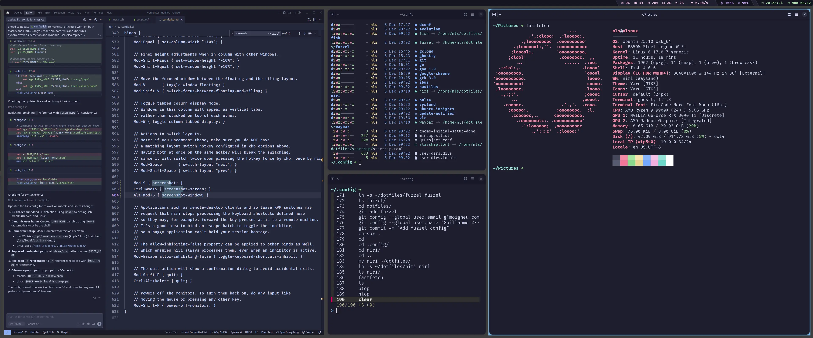

# 🚀 Dotfiles

A modern, cross-platform dotfiles configuration for macOS and Linux, featuring a beautiful Catppuccin Mocha theme throughout.



## ✨ Features

- **Cross-Platform**: Automatically detects macOS (Intel & Apple Silicon) and Linux
- **Modern Shell**: Fish shell with intelligent aliases and functions
- **Beautiful Prompt**: Starship prompt with minimal left-side, full info on right
- **Terminal Emulator**: Ghostty with Catppuccin Mocha theme
- **Application Launcher**: Fuzzel with matching theme
- **System Bar**: Waybar with comprehensive system monitoring
- **Window Manager**: Niri compositor configuration
- **Package Manager**: Homebrew integration for both macOS and Linux
- **Development Tools**: Pre-configured for Node.js (nvm), Go, Rust, Docker, Kubernetes, and more

## 📦 What's Included

### 🐚 Fish Shell (`fish/`)

A fully configured Fish shell with:
- OS detection and dynamic user paths (works on both macOS and Linux)
- Homebrew integration (auto-detects Apple Silicon, Intel Mac, or Linuxbrew)
- Modern file system tools (eza, fzf with bat preview)
- Node.js version management (nvm)
- Directory navigation (zoxide)
- Git aliases and shortcuts
- Cloud SDK support (Google Cloud, Platform.sh)
- Package manager paths (pnpm, cargo)

**Notable Features:**
- `ls` → beautiful eza output with icons
- `cd` → zoxide smart jumping
- `ff` → fuzzy file finder with preview
- `open` → cross-platform file opener

### ⭐ Starship Prompt (`starship/`)

Minimalist prompt configuration:
- Directory and git branch on the left
- All other info (language versions, cloud context, etc.) on the right
- Catppuccin Mocha color palette
- AWS, Golang, and Kubernetes context support
- Fast rendering (1s timeout)

### 👻 Ghostty Terminal (`ghostty/`)

Modern GPU-accelerated terminal emulator:
- Catppuccin Mocha theme
- Fira Code font with ligatures
- Optimized for both macOS and Linux
- Mouse hiding while typing
- Custom cursor style (bar)
- Balanced window padding

### 🔍 Fuzzel (`fuzzel/`)

Wayland-native application launcher:
- Catppuccin Mocha colors
- Fira Code font
- Fast fuzzy matching
- Beautiful transparency

### 📊 Waybar (`waybar/`)

Comprehensive system bar with:
- CPU, temperature, and memory monitoring
- NVIDIA GPU monitoring
- Network information
- Audio controls (input/output)
- Audio visualizer (cava)
- Backlight control
- Weather widget
- Custom styling with Catppuccin theme

### 🪟 Niri (`niri/`)

Scrollable-tiling Wayland compositor configuration.

## 🛠️ Installation

### Prerequisites

**macOS:**
```bash
# Install Homebrew (if not already installed)
/bin/bash -c "$(curl -fsSL https://raw.githubusercontent.com/Homebrew/install/HEAD/install.sh)"
```

**Linux:**
```bash
# Install Homebrew (if not already installed)
/bin/bash -c "$(curl -fsSL https://raw.githubusercontent.com/Homebrew/install/HEAD/install.sh)"
```

### Quick Start

1. Clone this repository:
```bash
cd ~
git clone https://github.com/yourusername/dotfiles.git
```

2. Run the installation script:
```bash
cd ~/dotfiles
chmod +x install.sh
./install.sh
```

This will create symlinks in `~/.config/` for:
- `starship.toml`
- `ghostty/`
- `fish/`
- `fuzzel/`
- `waybar/`

3. Install Fish shell (if not already installed):
```bash
# macOS
brew install fish

# Linux
brew install fish
# or use your package manager
```

4. Set Fish as your default shell:
```bash
# Add fish to /etc/shells (if needed)
which fish | sudo tee -a /etc/shells

# Change default shell
chsh -s $(which fish)
```

5. Install recommended tools:
```bash
brew install starship eza zoxide fzf bat nvm
```

### Optional Tools

For the full experience, install these additional tools:

```bash
# Terminal emulator
brew install ghostty

# Wayland tools (Linux only)
# Install via your package manager:
# - fuzzel (application launcher)
# - waybar (status bar)
# - niri (window manager)
```

## 🎨 Theme

This configuration uses the **Catppuccin Mocha** color palette throughout:
- Terminal: Catppuccin Mocha
- Prompt: Catppuccin Mocha
- Application launcher: Catppuccin Mocha
- System bar: Catppuccin Mocha

The theme provides a cohesive, modern, and easy-on-the-eyes experience across all applications.

## 🔧 Customization

### Changing the Theme

To use a different Ghostty theme, edit `ghostty/config`:
```
theme = your-theme-name
```

Available themes are in `ghostty/themes/`.

### Modifying the Prompt

Edit `starship/starship.toml` to customize:
- Module order
- Icons
- Colors
- Git branch display
- Language version display

### Adding Aliases

Add your custom aliases to `fish/config.fish` in the interactive section.

### Path Configuration

The configuration automatically handles paths for both macOS and Linux. All paths use `$USER_HOME` which expands to your home directory dynamically.

## 📝 Key Bindings & Aliases

### Fish Shell Aliases

**File System:**
- `ls` → eza with icons and details
- `lsa` → ls including hidden files
- `lt` → tree view (2 levels)
- `lta` → tree view including hidden
- `ff` → fuzzy find with preview
- `..`, `...`, `....` → quick parent directory navigation

**Development:**
- `d` → docker
- `v` → nvim
- `g` → git
- `gcm` → git commit -m
- `gcam` → git commit -a -m
- `gcad` → git commit -a --amend

**Cloud:**
- `u` → upsun
- `up` → upsun push -y
- `ud` → git push upsun && upsun deploy

## 🔍 Troubleshooting

### Fish shell shows errors on startup

Make sure all required tools are installed:
```bash
brew install starship eza zoxide fzf
```

### Homebrew not found

The configuration tries to detect Homebrew automatically. If it fails:
- **macOS (Apple Silicon)**: Ensure Homebrew is at `/opt/homebrew/`
- **macOS (Intel)**: Ensure Homebrew is at `/usr/local/`
- **Linux**: Ensure Homebrew is at `/home/linuxbrew/.linuxbrew/`

### NVM not working

Install nvm via Homebrew:
```bash
brew install nvm
mkdir ~/.nvm
```

### Ghostty not displaying correctly

Make sure Fira Code font is installed:
```bash
# macOS
brew install font-fira-code

# Linux
# Use your package manager or download from:
# https://github.com/tonsky/FiraCode
```

## 🤝 Contributing

Feel free to fork this repository and customize it for your own use. Pull requests are welcome!

## 📄 License

Licensed under the Apache License, Version 2.0. See [LICENSE](LICENSE) for details.

## 🙏 Acknowledgments

- [Catppuccin](https://github.com/catppuccin/catppuccin) - Beautiful pastel theme
- [Starship](https://starship.rs/) - Fast and customizable prompt
- [Fish Shell](https://fishshell.com/) - Smart and user-friendly shell
- [Ghostty](https://ghostty.org/) - Modern terminal emulator
- [eza](https://github.com/eza-community/eza) - Modern ls replacement
- [zoxide](https://github.com/ajeetdsouza/zoxide) - Smarter cd command
- [fzf](https://github.com/junegunn/fzf) - Fuzzy finder

---

Made with ❤️ for a better terminal experience

